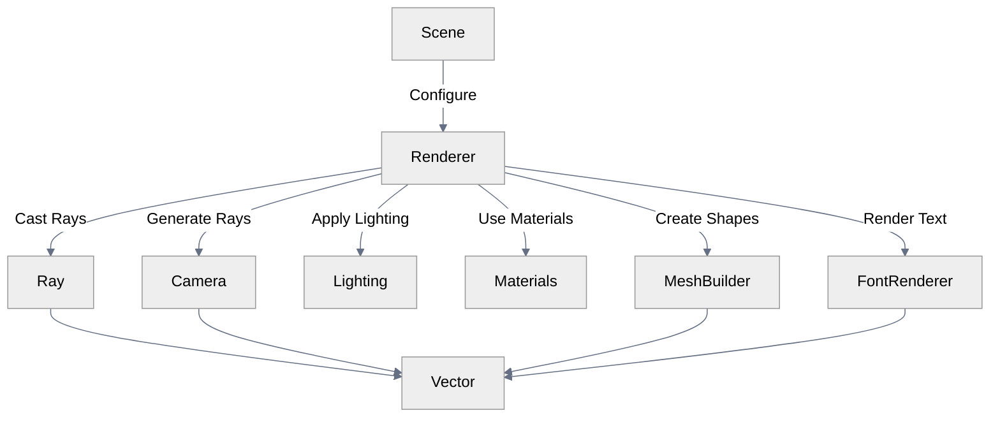

# Python Ray Tracing Renderer

## Overview

This project is a ray tracing rendering engine implemented in Python, capable of creating complex 3D scenes with advanced rendering techniques including reflections, refractions, shadows and 3D text rendering.

## Features

- 🌈 Advanced Ray Tracing Rendering
- 📷 Configurable Camera System
- 🧊 Procedural 3D Shape Generation
- 💡 Multiple Light Source Support
- 📝 3D Text Rendering
- 🎨 Customizable Materials
- 🌟 Reflection and Refraction
- 🕯️ Shadow Casting

## Project Structure



## Key Components

### Core Files
- `vector.py`: 3D vector operations
- `ray.py`: Ray casting and intersection logic
- `camera.py`: Camera positioning and ray generation
- `renderer.py`: Main ray tracing engine

### Geometry Generation
- `mesh_builder.py`: Creates 3D shapes (cubes, pyramids, cylinders)
- `scene_utils.py`: Shape manipulation and rotation utilities

### Scene Management
- `main.py`: Command-line interface for rendering scenes
- Scene scripts (`scene_1.py`, `scene_text.py`, etc.): Predefined scene configurations

### Advanced Features
- `font_renderer.py`: Converts text into 3D triangular meshes
- `lighting.py`: Point and directional light implementations
- `materials.py`: Predefined material types with optical properties

## Rendering Techniques

The renderer supports multiple advanced rendering techniques:
- Ray-object intersection (spheres, triangles)
- Reflection and refraction
- Shadow casting
- Ambient, diffuse, and specular lighting
- Perspective camera projection
- Multi-sample anti-aliasing

## Scene Creation Example

```python
from vector import Vector
from materials import create_standard_materials

def setup_scene(raster):
    # Create materials
    materials = create_standard_materials()

    # Add a reflective sphere
    raster.add_sphere(
        center=Vector(0, 0, 50),
        radius=60,
        material=materials['glass']
    )

    # Set up lighting
    raster.add_light(PointLight(
        position=Vector(-300, -300, -200),
        intensity=0.5
    ))

    # Configure camera
    raster.set_camera(
        position=Vector(0, 0, -400),
        look_at=Vector(0, 0, 0),
        fov=45
    )
```

## Running the Renderer

```bash
# Basic usage
python main.py scene_1.py

# Render with custom resolution
python main.py scene_1.py 1920 1080

# Generate preview
python main.py scene_1.py --preview 0.25
```

## Dependencies

- NumPy
- Pillow (PIL)
- Python 3.7+

## Installation

1. Clone the repository
2. Install dependencies: `pip install numpy pillow`
3. Run scenes with `python main.py [scene_file]`

## Contributing

Contributions are welcome! Please feel free to submit a Pull Request.

## License

[Add your license information here]

## Future Improvements

- Implement more complex materials
- Add support for more geometric primitives
- Optimize rendering performance
- Implement global illumination techniques